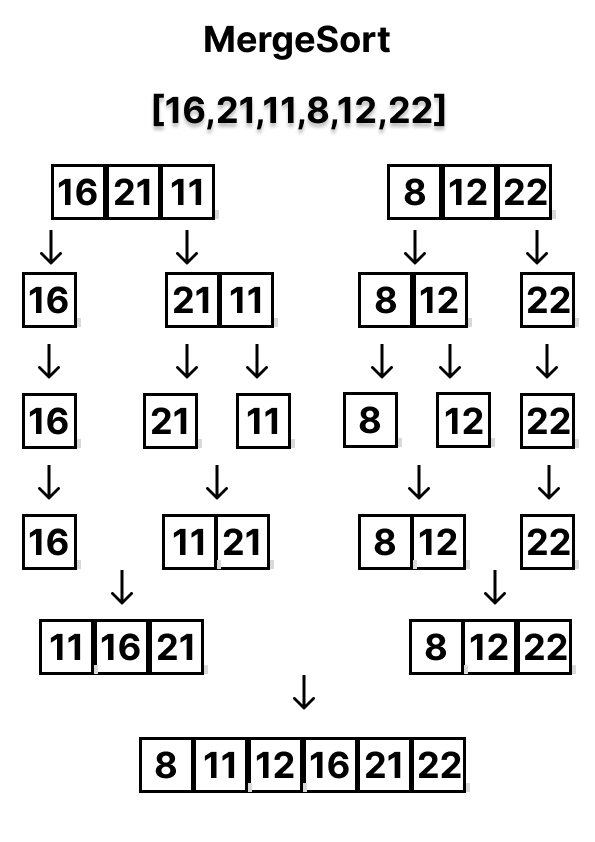
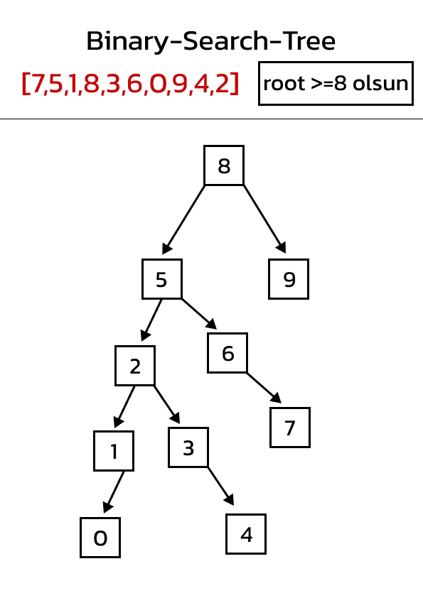

# **Veri Yapıları ve Algoritmalar**
# **Proje1** 

> ### 1.Soru 
>[22,27,16,2,18,6] dizini sort türüne göre aşamlarını yazınız (insertion sort)

`
Cevap:
`
* [2,27,16,22,18,6] 
* [2,6,16,22,18,27] 
* [2,6,16,18,22,27]

***

> ### 2.Soru 
> Big-O Gösterimini Yazınız..

`
Cevap: [n(n+1)]/2 = (n^2+n)/2 'den Big O Notation : O(n^2)
`

***

> ### 3.Soru 
> Time Complexity: Dizi sıralandıktan sonra 18 sayısı aşağıdaki case'lerden hangisinin kapsamına girer..

`
Cevap: Diziye bakıldığında aranan sayıya göre Average case (sayının ortada olması)
`

***

> ### 4.Soru 
> [7,3,5,8,2,9,4,15,6] dizisinin Selection Sort'a göre ilk 4 adımını yazınız..

`
Cevap: 
(1) [2,3,5,8,7,9,4,15,6]
(2) [2,3,4,8,7,9,5,15,6]
(3) [2,3,4,5,7,9,8,15,6]
(4) [2,3,4,5,6,9,8,15,7] 
`

***
# **Proje2**
> ### 1.Soru 
> [16,21,11,8,12,22] - Merge Sort \
> Yukarıdaki dizinin sort türüne göre aşamalarını yazınız \

> ### 2.Soru
> Big-O gösterimini yazınız.. \
`
Cevap: 2^x=n -> logn=x
`
***

# **Proje3**
> ### 3.Soru
> **[7,5,1,8,3,6,0,9,4,2]** dizisinin Binary-Search-Tree aşamalarını yazınız.\
> 

